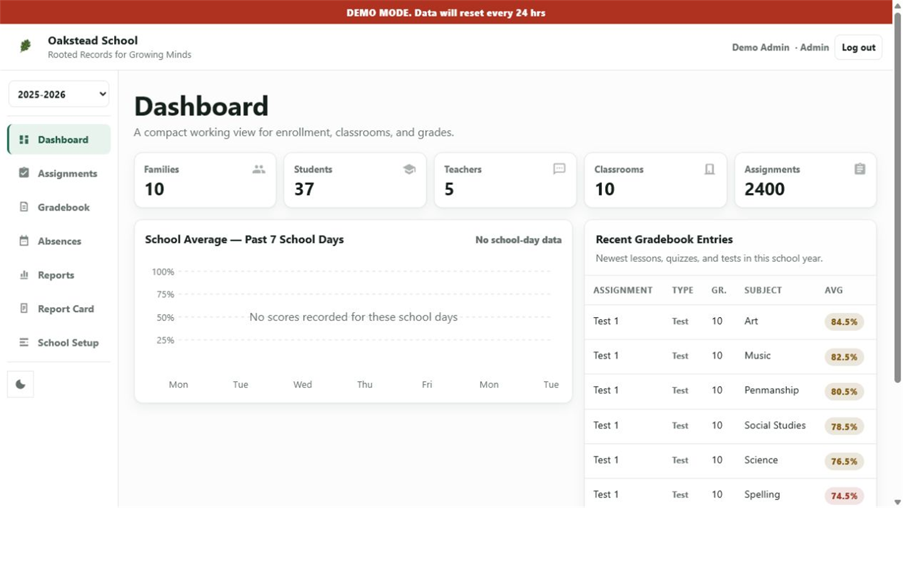
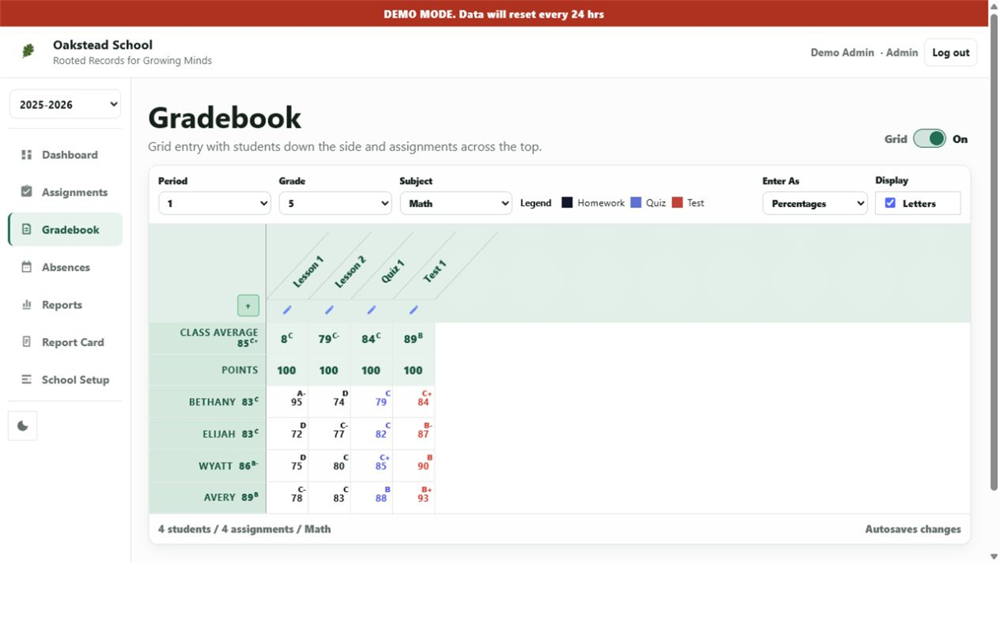
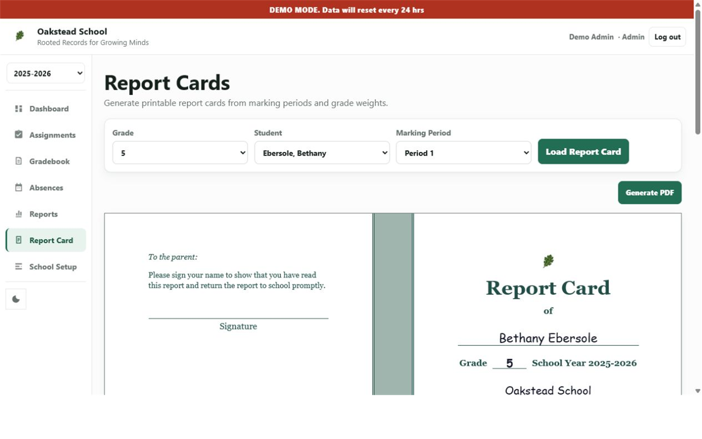

  

<h1 align="center">Oakstead</h1>

  <strong>Rooted Records for Growing Minds.</strong> 
  A straightforward school records and gradebook app for small schools.

  
  
  

  <a href="https://demo.oakstead.school"><strong>Explore the live demo</strong></a>
  &nbsp;·&nbsp;
  <a href="https://github.com/kirbw/oakstead/releases/latest">View the latest release</a>
  &nbsp;·&nbsp;
  <a href="docs/INSTALLATION.md">Installation guide</a>

## School records without enterprise complexity

Oakstead gives small schools one calm, organized place for the information they use every day. Keep families and students together, enter grades quickly, track attendance, prepare reports, and carry records forward from one school year to the next.

It is a good fit for private schools, classical schools, microschools, homeschool co-ops, and anyone who has outgrown a collection of spreadsheets but does not want a large subscription-based student information system.

## What Oakstead can do

| | |
|---|---|
| **Families and students** Keep household contacts, birthdays, congregations, districts, enrollment history, grade placement, and classroom assignments together. | **Gradebook and assignments** Enter an entire class quickly, use a spreadsheet-style grid, and calculate averages with custom weights and letter-grade scales. |
| **Attendance and school years** Record absences and tardies, filter by grade or student, promote students, and still view prior-year records. | **Reports and report cards** Create printable family, student, birthday, grade, and school-board reports, plus polished report cards and grade graphs. |
| **The right access for each person** Give administrators, principals, teachers, and parents focused access to the records and tools appropriate to their role. | **Your data, under your control** Run Oakstead on your own computer or trusted network, keep data in a single SQLite database, and create or restore backups from the app. |

## See it in action

<table>
  <tr>
    <td width="50%">
      
       <strong>Fast grade entry.</strong> Students, assignments, averages, and letter grades stay visible in one working view.
    </td>
    <td width="50%">
      
       <strong>Reports families can use.</strong> Build a printable report card directly from marking periods, grades, and attendance.
    </td>
  </tr>
</table>

The [public demo](https://demo.oakstead.school) is filled with sample school data and resets regularly, so you can explore freely.

## Get started

1. **Try it first.** Open the [live demo](https://demo.oakstead.school) to explore the Dashboard, Gradebook, Reports, Report Cards, and School Setup.
2. **Ready to host it?** Follow the [installation and deployment guide](docs/INSTALLATION.md) for source-based Windows or Linux requirements, startup, configuration, networking, backups, and updates.

Oakstead does not currently publish a tested Windows installer. For now, Windows and Linux installations run from source.

The first real login uses `admin` / `ChangeMeNow!`. Change that password before entering school data.

> [!IMPORTANT]
> Oakstead stores sensitive student and family records. Run it on a trusted local network or VPN. If remote access is necessary, use HTTPS and a protective reverse proxy with appropriate access controls. Do not expose a real Oakstead installation directly to the public internet.

## Why self-host Oakstead?

- No required monthly subscription
- No separate database server
- Responsive on phones, tablets, and desktops
- In-app backups and release updates
- Local control over school records and uploaded assets
- Open source under the MIT License

Oakstead uses a lightweight Node.js server and SQLite database, with server-rendered pages and no frontend framework. Technical requirements and configuration live in the [installation guide](docs/INSTALLATION.md).

## Documentation

- [Installation, configuration, and security](docs/INSTALLATION.md)
- [Release notes](RELEASE_NOTES.md)
- [Linux deployment](packaging/linux/README.md)
- [Project website](https://oakstead.school)
- [MIT License](LICENSE)

---

Built for schools that want their records organized, understandable, and close to home.

